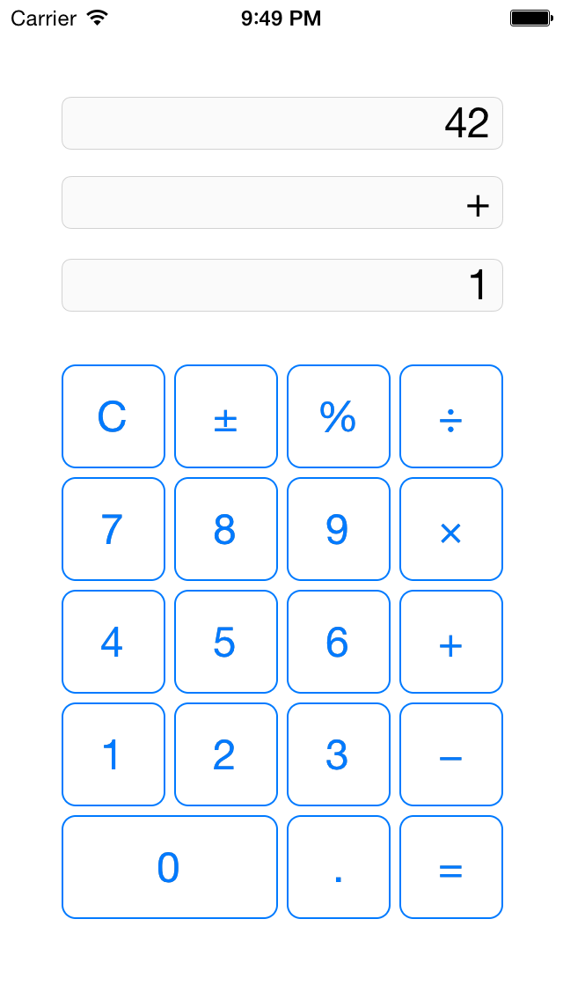

iOS_coLearning_HW3_Calculator
=============================

Homework #3 for iOS coLearning. Create a calculator app using outlets and actions.

For grins I added a twist to the traditional calculator by providing 3 displays (to show both operands and the operator).

